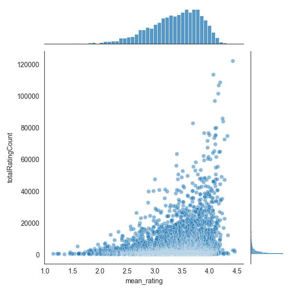
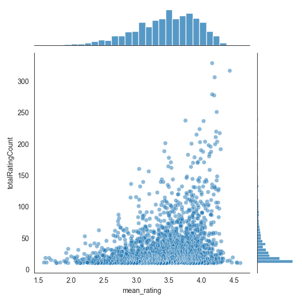

# Movie recommendation system

## Description

This project is a Flask app for a movie recommendation system that uses two types of
[collaborative filtering](https://en.wikipedia.org/wiki/Collaborative_filtering) algorithms based on data of
similar users. The algorithms used are recommendations by Pearson correlation coefficients and k-Nearest Neighbors
(KNN) method.
<br><br>

### MovieLens dataset

The system is built on the [MovieLens dataset](https://grouplens.org/datasets/movielens/). At the step of model creation
(_pkl_production.py_, see below), there are two dataset size options to choose from:

**_Full_**: 27,000,000 ratings and 1,100,000 tag applications applied to 58,000 movies by 280,000 users.

**_Small_**: 100,000 ratings and 3,600 tag applications applied to 9,000 movies by 600 users.

Note: provided numbers are according to 9/2018 update.

<div style="display: flex; justify-content: center;">


</div>
Fig.1: Visualisation of 'mean_rating' vs 'totalRatingCount' per movie of the full and small datasets, respectively. 

<br>
<br>

### Steps of the app creation

The app is constructed in two steps:

#### 1) pickle files creation (_pkl_production.py_ script)

The recommendation system utilizes two different models on a movie rating dataset: a KNN model and a Pearson correlation 
model. For the KNN model, it filters out unpopular movies, trains the model, and saves the model and a pivot table of 
movie features to a pickle file. For the Pearson correlation model, it just filters out unpopular movies and saves a 
pivot table of movie features to a pickle file. The script imports utility functions from the _movie_recommend.utils_ 
module to retrieve and format the movie rating data, train the models, and save the results to a file. The minimum 
number of ratings per movie, the size of the dataset, and the type of model can be configured by modifying the variables 
at the top of the script.

Note: Upon the first run, the dataset is automatically downloaded from the repository and stored in the _raw_data_
folder. Subsequent runs of the application will load the database from the folder, without requiring any additional 
downloads from the repository.

#### 2) Flask app for movie recommendations (_app.py_ script)

The script creates a Flask web application that generates movie recommendations using models loaded from pickle files.
For KNN, both the model and a pre-cleaned movie table are loaded, while the Pearson correlation algorithm only loads a
pre-cleaned movie table (correlation coefficients are calculated later, in _recommendation_corr()_ function). The Flask
app defines two routes: _/recommend_api_ for receiving POST requests with input data in JSON format and returning
recommendations as JSON, and _/recommend_ for receiving input values from an HTML form and returning recommendations
as HTML. The app uses a _get_recommendations()_ function to calculate the movie recommendations, based on the selected
model and features. The app runs in debug mode if executed as the main program.
<br><br>

### Files in the repository

_/movie_recommend/pkl_production.py_ - script to create pickle files with models and a pre-cleaned movie tables.

_/movie_recommend/app.py_ - script to create a Flask web application that generates movie recommendations using models loaded from pickle
files.

_/movie_recommend/constants.py_ - constants used in a scripts.

_/movie_recommend/ratings_visualisation.py_ - optional script to visualize 'mean_rating' vs 'totalRatingCount' per movie
(returns png files).

_/movie_recommend/utils/_ - folder with functions used in a scripts.

_/templates/home.html_ - front-end html file.

_requirements.txt_ - Python packages necessary for the app creation.

_/tests/_ - folder with pytest scripts to test the functionality of the functions.
<br><br>

## Installation

Before running the scripts to create the app, make sure you have Python 3.7 or higher installed. You can install the 
required Python packages using the following command:

```
$ pip install -r requirements.txt
```
<br>

## App usage

To access the app, run _app.py_ and then navigate to http://localhost:5000/ in your web browser.

To use the app, follow these steps:

1. Enter the title of a movie in the input field labeled "Title".
2. Enter the number of recommended movies you would like to see in the input field labeled "Number of movies".
3. Choose one of the two algorithms available for recommendations by selecting the corresponding radio button.
4. Click on the "Recommend" button to generate the list of recommended movies.
5. The list of recommended movies will be displayed on the page.

Note: if the provided title is not in the database, the app will output titles based on text similarity score.
<br><br>

## License

This project is licensed under version 2.0 of the Apache License - see the LICENSE file for details.